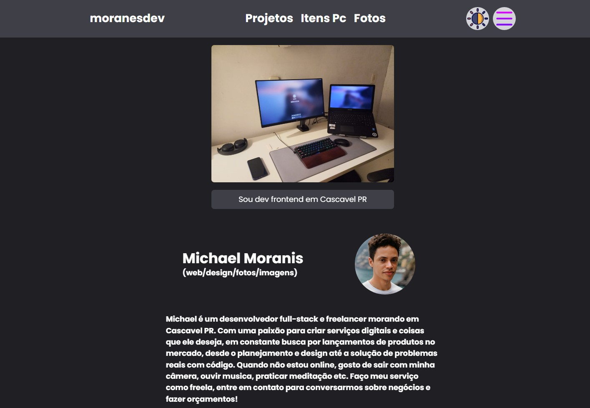

## Desenvolvimento do Meu Portfólio

Recentemente, conclui o desenvolvimento do meu portfólio usando uma combinação de tecnologias modernas, incluindo React, TypeScript, Framer Motion, React Router DOM e TailwindCSS. A experiência foi enriquecedora e me proporcionou um profundo entendimento sobre componetização, roteamento e estilização.



### Tecnologias Utilizadas

**React e TypeScript**: A base do meu portfólio é construída com React e TypeScript. O React permite a criação de componentes reutilizáveis e a construção de uma interface de usuário interativa e dinâmica. O TypeScript, por sua vez, trouxe robustez ao projeto, oferecendo um sistema de tipos que ajuda a prevenir erros e melhora a manutenção do código.

**Framer Motion**: Para adicionar animações e transições fluidas, utilizei o Framer Motion. Esta biblioteca facilitou a implementação de efeitos visuais que melhoraram a experiência do usuário, tornando a navegação mais envolvente e atraente.

**React Router DOM**: O roteamento foi gerenciado pelo React Router DOM. Essa ferramenta possibilitou a criação de uma navegação eficiente entre as páginas do portfólio, permitindo uma experiência de usuário intuitiva e bem estruturada.

**TailwindCSS**: A estilização do portfólio foi feita com TailwindCSS, uma framework de CSS utilitário. O TailwindCSS não só acelerou o processo de desenvolvimento com suas classes de utilitários, mas também me proporcionou uma maneira eficiente e flexível de criar layouts responsivos e estilizados.

### Aprendizado e Implementações

**Componetização**: Durante o desenvolvimento, aprendi a importância da componetização no React. Dividir a aplicação em componentes menores e reutilizáveis não apenas facilitou o gerenciamento do código, mas também tornou o projeto mais modular e fácil de manter. Cada componente, como o `Header`, `Banner`, e `Perfil`, foi projetado para encapsular uma funcionalidade específica, contribuindo para um código mais limpo e organizado.

**Roteamento**: Implementar o roteamento com o React Router DOM foi um passo crucial. A configuração das rotas permitiu que eu criasse uma navegação fluida entre as diferentes seções do meu portfólio, melhorando a experiência do usuário e facilitando a estruturação do conteúdo.

**Estilização com TailwindCSS**: A estilização foi um dos aspectos mais satisfatórios do projeto. O TailwindCSS, com sua abordagem de utilitários, permitiu criar designs responsivos e personalizados de forma ágil. Além disso, aprendi a aplicar gradientes suaves e harmoniosos, alinhados com minha preferência por uma estética mais coesa.

**Testes com e2e com Cypress.
O Cypress é uma ferramenta de teste end-to-end (E2E) moderna, focada em testes automatizados para aplicações web. Ele permite que você escreva testes para interagir com o DOM, verificar comportamentos e garantir que a aplicação funcione conforme o esperado.

### Conclusão

Desenvolver meu portfólio foi uma experiência valiosa que consolidou meu conhecimento em React, TypeScript, animações com Framer Motion, roteamento com React Router DOM e estilização com TailwindCSS. Cada tecnologia contribuiu de forma significativa para a criação de um portfólio visualmente atraente e funcional, refletindo minhas habilidades e aprendizado ao longo da jornada de desenvolvimento.

---

## Melhorias e Correções Recentes

### 1. Modernização do Componente Header

**Problemas Identificados:**
- Design visual pouco impactante
- Falta de contraste nas cores
- Desalinhamento em telas com 810px
- Responsividade inadequada

**Soluções Implementadas:**

#### 🎨 Estilo Moderno com Gradientes
- Adicionado gradientes dinâmicos (Blue → Purple → Pink) no logo e links
- Sistema de cores claro por padrão, gradiente no hover
- Backdrop blur aprimorado com `blur-2xl` para melhor transparência
- Sombras refinadas com efeito de profundidade

#### 📱 Responsividade Melhorada
- Ajustes de breakpoints: `lg:flex` para nav (antes `md:flex`)
- Padding adaptativo: `px-3 sm:px-4 md:px-6 lg:px-8`
- Tamanho de fonte responsivo: `text-lg sm:text-xl md:text-2xl lg:text-3xl` (logo)
- Ícones com escala proporcional: `w-6 h-6 md:w-6 md:h-6 lg:w-7 lg:h-7`
- Corrigido desalinhamento em 810px com `flex-1 justify-center` na nav

#### ✨ Efeitos e Animações
- Transições suaves com `duration-300` e `ease-out`
- Hover effects: escala, rotação de ícones
- Underline animado nos links com `scale-x-0/100`
- Spotlight effect com `pointer-events-none`

#### 🎯 Acessibilidade e UX
- Adicionado `pointer-events-none` em elementos decorativos
- Melhor hit area dos botões
- Cores com bom contraste WCAG
- Aria labels em botões interativos

**Resultado:** Header moderno, profissional e totalmente responsivo

---

### 2. Aprimoramento da Galeria de Imagens (Pages/Images)

**Problemas Identificados:**
- Sem tratamento de erro para imagens que não carregam
- Modal inadequado para telas pequenas (max-h-[60vh])
- Sem funcionalidade de filtro/busca

**Soluções Implementadas:**

#### 🖼️ Tratamento de Erros em Imagens
```tsx
const [imageErrors, setImageErrors] = useState<Set<string>>(new Set());

const handleImageError = useCallback((src: string) => {
  setImageErrors((prev) => new Set([...prev, src]));
}, []);
```
- Rastreamento de imagens que falharam ao carregar
- Placeholder elegante com mensagem de erro
- Exibição do nome da imagem no fallback
- Estado gerenciado com performance otimizada

#### 📏 Modal Responsivo
- Mudado de `max-h-[60vh]` para `max-h-[90vh]`
- Adicionado `flex flex-col overflow-y-auto` para scroll interno
- Estrutura flexível que funciona em qualquer tamanho de tela
- Melhor posicionamento do botão fechar com `z-10`
- Aprovado para dispositivos mobile e desktop

#### 🔍 Sistema de Filtros por Tag
```tsx
const [selectedTag, setSelectedTag] = useState<string | null>(null);
const filteredImages = selectedTag
  ? images.filter((img) => img.tag === selectedTag)
  : images;
```
- Botões interativos para filtrar por categoria
- Botão "Todas" para resetar o filtro
- Feedback visual dos filtros selecionados com cores dinâmicas
- Animação suave ao trocar filtros com `AnimatePresence`
- Delay escalonado nas imagens para efeito cascata
- Mensagem amigável quando nenhuma imagem é encontrada

**Tags Disponíveis:**
- Workflow
- Design Thinking
- Frontend Architecture
- Craftsmanship
- Mindset

**Resultado:** Galeria funcional, acessível e com melhor UX

---

### 3. Atualizações de Dependências

**Correções Realizadas:**
- Instalação de todas as dependências do projeto
- Correção de 11 vulnerabilidades de segurança
- Vite atualizado para versão 7.3.1 (com mudanças breaking tratadas)
- Resolução de issues de compatibilidade
- Auditoria de dependências com `npm audit fix --force`

**Dependências Principais Mantidas:**
- React 18.3.1
- TypeScript 5.2.2
- Framer Motion 11.3.28
- Tailwind CSS 3.4.7
- Vite 7.3.1

**Resultado:** Projeto estável e seguro

---

### 4. Mudancas Recentes (UI/Temas)

**WorkText (Timeline)**
- Ajuste de contraste para light/dark no ano, titulo e descricao
- Marcadores e divisor alinhados com a paleta azul do projeto
- Leitura mais confortavel em ambos os temas

**Pagina de Contato**
- Criacao da rota e estrutura da pagina
- Layout minimalista com card glass e grid responsivo
- Links clicaveis (email, WhatsApp, LinkedIn e GitHub)
- Ajustes de acessibilidade com foco visivel
- Inclusao da foto de perfil alinhada ao titulo

**Deploy (Vercel)**
- Adicionado `vercel.json` com rewrite para SPA (React Router)
- Corrige 404 ao recarregar rotas secundarias em producao

---

## Commits Realizados

Todas as alterações foram commitadas e enviadas para o repositório:

```bash
commit: style: modernize header component with gradient effects and responsive fixes
- Updated header styling with modern gradient effects
- Improved color contrast (clear text by default, gradient on hover)
- Added smooth animations and transitions
- Fixed responsive issues at 810px breakpoint
- Improved accessibility with pointer-events-none on decorative elements
- Updated dependencies to fix security vulnerabilities
```

Repositório: [MichaelMoranis/portifolio](https://github.com/MichaelMoranis/portifolio)

---
